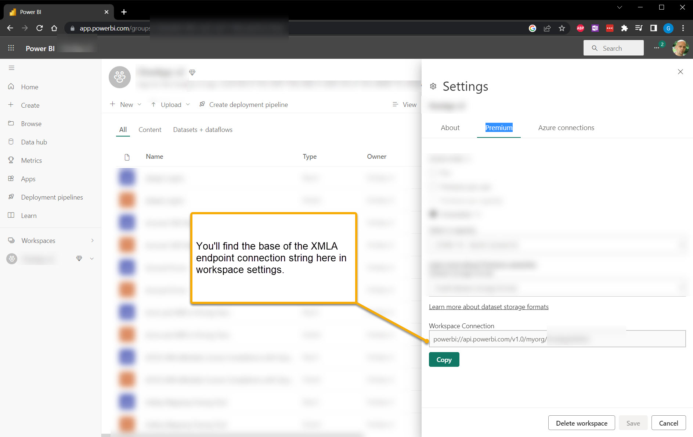

# About

I wanted to consume some info from Azure Analysis Services from python and didn't see a convenient way to to do, so I wrote this. It should also work just fine with XMLA endpoints on Power BI Premium. 

pymsasdax is a small Python Module for running DAX queries against Microsoft Analysis Services, using COM Interop. It does some basic typesniffing and returns a best guess Pandas Dataframe. 

This does assume that the MSOLAP client is installed - you can get it from [here](https://learn.microsoft.com/en-us/analysis-services/client-libraries?view=asallproducts-allversions)

I've done very little testing, so consider this alpha code. If you run into timeouts, make sure you're setting the timeout to an appropriate duration when creating the Connection. 

tidy_column_names will remove brackets and replace spaces with underscores in the returned dataframe's columns. Set it to False in the Connection init if you don't want this behavior.

Also, this is my first module up on pypi and I'm not exactly an expert on python, so feel free to submit an issue or a pull request. If I ended up reinventing the wheel here (ha!) and there was an easier way to do this, also please let me know.

I hope you find this useful!

## Python before 3.9

This should actually work fine with for python 3 under 3.9. I've used this code for a couple of years now without incident -- I was just lazy when building this package. I **think** you'd need backports to support [dateparser](https://pypi.org/project/dateparser/). Feel free to path and submit a PR if you like. 

# Usage examples

## Have an interactive prompt for Login to the resource

```python
from pymsasdax import dax

with dax.Connection(
        data_source='asazure://<region name>.asazure.windows.net/<instance here>,
        initial_catalog='<my tabular database>'
    ) as conn:
    df = conn.query('EVALUATE ROW("a", 1)')
    print(df)
```

## Query a Power BI Premium Workspace XMLA endpoint

You can also find the endpoint in your workspace settings, as shown below. You'll use the dataset name as the initial_catalog.




```python
from pymsasdax import dax

with dax.Connection(
        data_source='powerbi://api.powerbi.com/v1.0/myorg/<workspace name, spaces are fine>',
        initial_catalog='<dataset name - spaces are fine>'
    ) as conn:
    df = conn.query('EVALUATE ROW("a", 1)')
    print(df)
```

## Use an app id

```python
from pymsasdax import dax

with dax.Connection(
        data_source='asazure://<region name>.asazure.windows.net/<instance here>',
        initial_catalog='<my tabular database>'
        uid='app:<client id>@<tenant id>',
        password='<client secret>'
    ) as conn:
    df = conn.query('EVALUATE ROW("a", 1)')
    df.to_csv("raw_data.csv", index=False)        
```

## Rename columns your way
```python
from pymsasdax import dax

def my_column_renamer(colname):
    return colname.lower()

with dax.Connection(
        data_source='asazure://<region name>.asazure.windows.net/<instance here>',
        initial_catalog='<my tabular database>',
        tidy_map_function = my_column_renamer
    ) as conn:
    df = conn.query('EVALUATE SUMMARIZECOLUMNS (etc....etc...etc...)')
    print(df)
```

# Dev Notes

## Version History

* 2023.1014
  * Add at least some docstrings
  * Add Premium XMLA endpoint example
  * Add effective_user_name parameter to connection
  * Pass **kwargs as additional connection string key value pairs
* 2023.1013
  * Fix issue with column names populating from when i made initial package version
  * Allow specificiation of column name cleanup function
* 2023.1001 - Initial
## Tests

Yes. There aren't any. Feel free to submit a PR. 

## Building

This might not be right but if you ever go to update pypi - 
```
bumpver update --minor
pip-compile pyproject.toml
python -m pip install -e . 
#test
python -m build
twine check dist/*
twine upload dist/*
```

